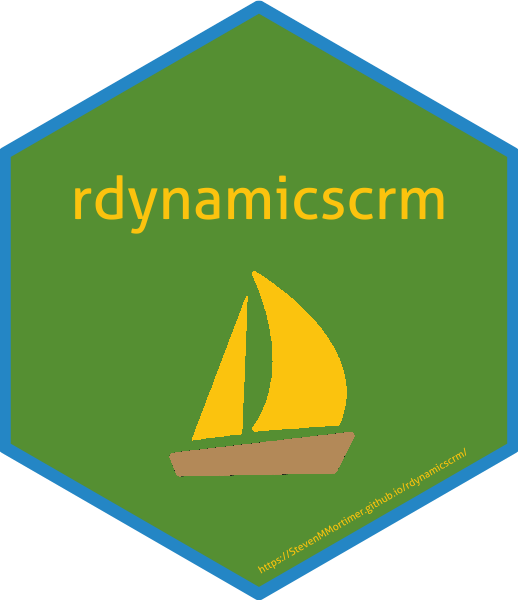

rdynamicscrm
==================================================================================

[](https://travis-ci.org/StevenMMortimer/rdynamicscrm) [](https://ci.appveyor.com/project/StevenMMortimer/rdynamicscrm) [](https://codecov.io/gh/StevenMMortimer/rdynamicscrm?branch=master)

**rdynamicscrm** is an R package that creates a client to connect to MS Dynamics CRM. Package features include:

-   An auto-refreshing authentication method (`dyn_auth()`)
-   CRUD (Create, Retrieve, Update, Delete) methods for records, such as:
    -   `dyn_create()`, `dyn_retreive()`, `dyn_update()`, `dyn_delete()`
-   Query records using `dyn_query()`
-   Basic utility calls (`dyn_whoami()`)

Table of Contents
-----------------

-   [Installation](#installation)
-   [Usage](#usage)
    -   [Authenticate](#authenticate)
    -   [Create](#create)
    -   [Query](#query)
    -   [Update](#update)
    -   [Delete](#delete)
-   [Future](#future)
-   [Credits](#credits)
-   [More Information](#more-information)

Installation
------------

``` r
# this package is not yet available on CRAN 
# install the latest version available on GitHub using the devtools package

# install.packages("devtools")
devtools::install_github("StevenMMortimer/rdynamicscrm")
```

If you encounter a clear bug, please file a minimal reproducible example on [GitHub](https://github.com/StevenMMortimer/rdynamicscrm/issues).

Usage
-----

### Authenticate

First, load the **rdynamicscrm** package and authenticate.

``` r
library(rdynamicscrm)

dyn_auth(url = "https://test.ztcrm.org/",
         username = "test@live.com", 
         password = "{PASSWORD_HERE}")
```

The `dyn_auth()` function will obtain a cipher and secret key that will be embedded in the header of each SOAP API call to securely access the CRM instance. After obtaining these authentication credentials, you can check your connectivity by looking at the information returned about the current user. It should be information about you!

``` r
# pull down information of person logged in
# it's a simple easy call to get started 
# and confirm a connection to the APIs
me <- dyn_whoami()
my_info <- dyn_retrieve(me$UserId, entity_name="systemuser", 
                        attributes=c("fullname", "isdisabled"))
#sprintf("Name: %s", my_info$fullname)
sprintf("Disabled?: %s", my_info$isdisabled)
#> [1] "Disabled?: false"
```

### Create

MS Dynamics CRM has entities and those entities contain records. One default entity is the "contact" entity. This example shows how to create two records in the contact entity.

``` r
n <- 2
new_contacts <- tibble(firstname = rep("Test", n),
                       lastname = paste0("Contact-Create-", 1:n))
created_records <- dyn_create(new_contacts, entity_name="contact")
created_records
#> # A tibble: 2 x 3
#>   id                                   success error_msg
#>   <chr>                                <lgl>   <chr>    
#> 1 1f2a025c-f49e-e811-80e9-001dd8b75c2b TRUE    <NA>     
#> 2 222a025c-f49e-e811-80e9-001dd8b75c2b TRUE    <NA>
```

### Query

MS Dynamics CRM has proprietary form of SQL called FetchXML. FetchXML is a powerful tool that allows you to return the attributes of records on almost any entity in MS Dynamics CRM including accounts, contacts, custom entities and more!

For simple "SELECT" queries you only need to specify the entity and the fields.

``` r
queried_records <- dyn_query(entity_name = "contact",
                             attributes = c("modifiedon", "donotbulkemail"), top=3)
queried_records
#> # A tibble: 3 x 3
#>   contactid                            donotbulkemail modifiedon         
#>   <chr>                                <chr>          <dttm>             
#> 1 de9c2055-e833-e211-8139-000c29e211a0 false          2012-11-21 14:33:17
#> 2 e29c2055-e833-e211-8139-000c29e211a0 false          2012-11-21 14:33:17
#> 3 e49c2055-e833-e211-8139-000c29e211a0 false          2012-11-21 14:33:17
```

Below is an example where we grab the two contact records we just created using FetchXML to specifically target those records.

``` r
my_fetchxml <- '<fetch version="1.0" output-format="xml-platform" mapping="logical" distinct="false">
                  <entity name="contact" >
                    <attribute name="firstname" />
                    <attribute name="lastname" />
                    <filter type="or">
                      <condition attribute="lastname" operator="eq" value="Contact-Create-1" />
                      <condition attribute="lastname" operator="eq" value="Contact-Create-2" />
                    </filter>
                  </entity>
                </fetch>'  
queried_records <- dyn_query(fetchxml=my_fetchxml)
queried_records
#> # A tibble: 2 x 3
#>   contactid                            firstname lastname        
#>   <chr>                                <chr>     <chr>           
#> 1 1f2a025c-f49e-e811-80e9-001dd8b75c2b Test      Contact-Create-1
#> 2 222a025c-f49e-e811-80e9-001dd8b75c2b Test      Contact-Create-2
```

### Update

After creating records you can update them using `dyn_update()`. Updating a record requires you to pass the MS Dynamics CRM `Id` of the record. MS Dynamics CRM creates a GUID (globally unique identifier) on each record and uses that to know which record to attach the update information you provide. Simply include a field or column in your update dataset called "Id" and the information will be matched. Here is an example where we update each of the records we created earlier with a new first name called "TestTest".

``` r
# Update some of those records
queried_records <- queried_records %>%
  mutate(firstname = "TestTest") %>% 
  rename(id=contactid)

updated_records <- dyn_update(queried_records, entity_name="contact")
updated_records
#> # A tibble: 2 x 3
#>   id                                   success error_msg
#>   <chr>                                <lgl>   <chr>    
#> 1 1f2a025c-f49e-e811-80e9-001dd8b75c2b TRUE    <NA>     
#> 2 222a025c-f49e-e811-80e9-001dd8b75c2b TRUE    <NA>
```

### Delete

Records can easily be deleted individually or in bulk by passing a vector of IDs to the `dyn_delete()` function. Here we will delete the two records that we created in this example.

``` r
ids_to_delete <- updated_records$id
deleted_records <- dyn_delete(ids_to_delete, entity_name="contact")
deleted_records
#> # A tibble: 2 x 3
#>   id                                   success error_msg
#>   <chr>                                <lgl>   <chr>    
#> 1 1f2a025c-f49e-e811-80e9-001dd8b75c2b TRUE    <NA>     
#> 2 222a025c-f49e-e811-80e9-001dd8b75c2b TRUE    <NA>
```

Future
------

Support for:

-   Online environments (not just On-Premise IFD environments)
-   Upsert
-   Related Entities

Credits
-------

This application has derived inspiration from other open source software components. The format of the XML in SOAP calls was created by following mimicking implementations in [Java](https://github.com/jlattimer/CRMSoapAuthJava) by Jason Lattimer and [Python](https://github.com/veeloinc/python-dynamics) by Veelo, Inc. In addition, inspiration was drawn from examples created by Jamie Miley that are available on his [blog](http://mileyja.blogspot.com/p/microsoft-dynamics-crm-2011-sdk-example.html). We acknowledge and are grateful to these developers for their contributions to open source.

More Information
----------------

Microsoft provides support with a C\# client library. Unfortunately R is not a supported language. However, most all operations supported by Dynamics CRM can be made available via this package. This package makes requests best formatted to match what the API requires as input. This articulation is not perfect and continued progress will be made to add and improve functionality. For details on formatting, attributes, and methods please refer to [Microsoft's documentation](https://docs.microsoft.com/en-us/dynamics365/customer-engagement/developer/use-microsoft-dynamics-365-organization-service) as they are explained better there.

More information is also available on the `pkgdown` site at <https://StevenMMortimer.github.io/rdynamicscrm>.

[Top](#rdynamicscrm.)

------------------------------------------------------------------------

Please note that this project is released with a [Contributor Code of Conduct](CONDUCT.md). By participating in this project you agree to abide by its terms.
